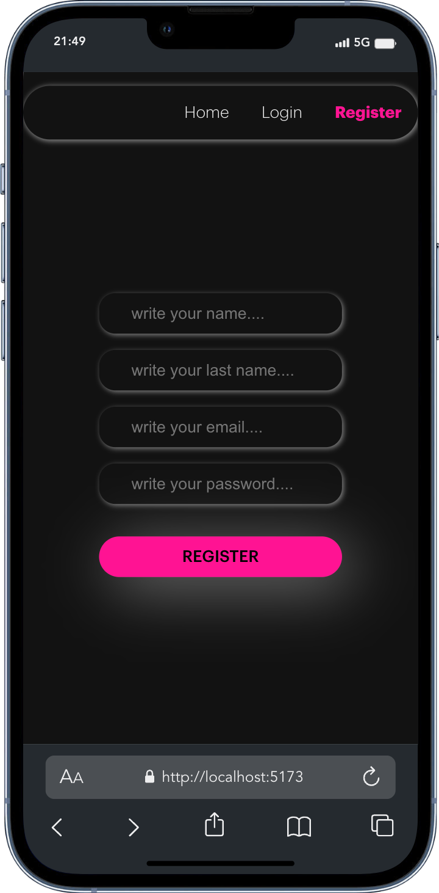
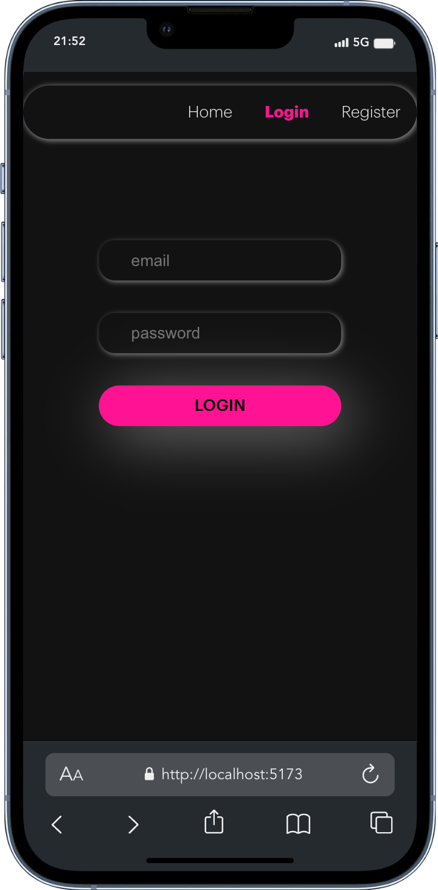
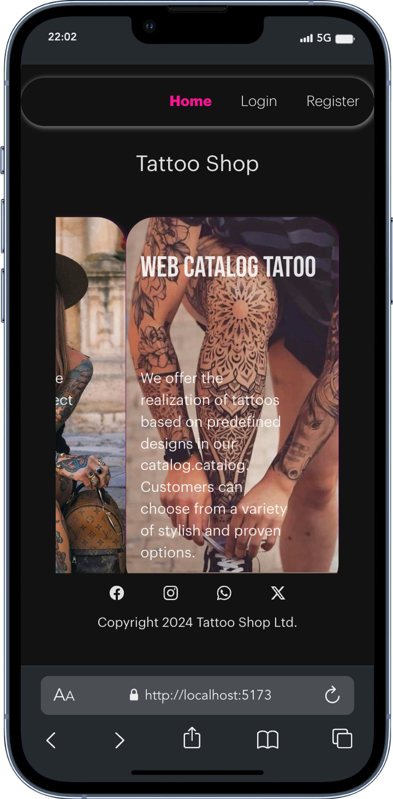
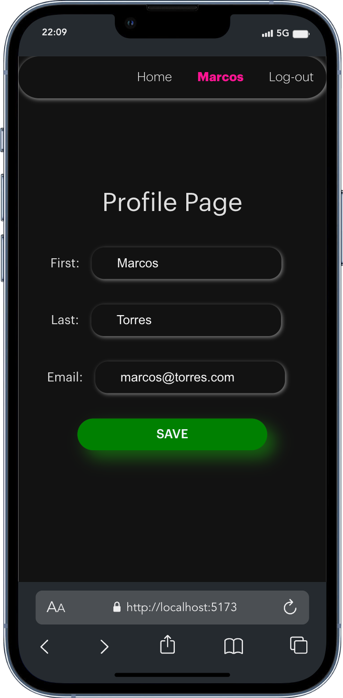
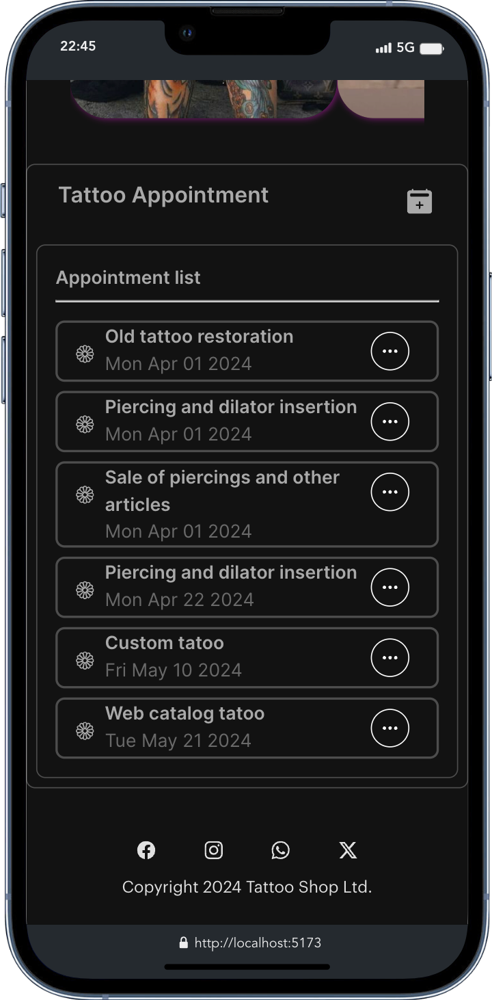
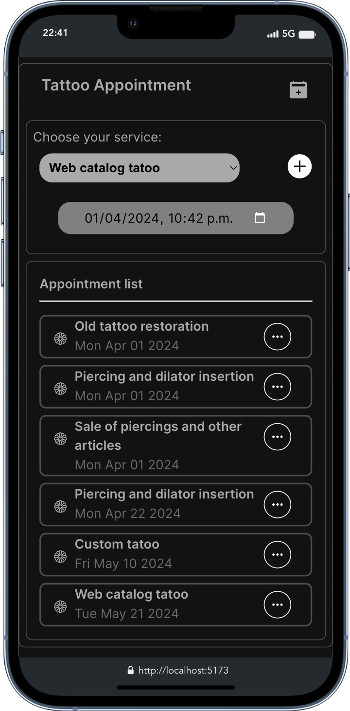
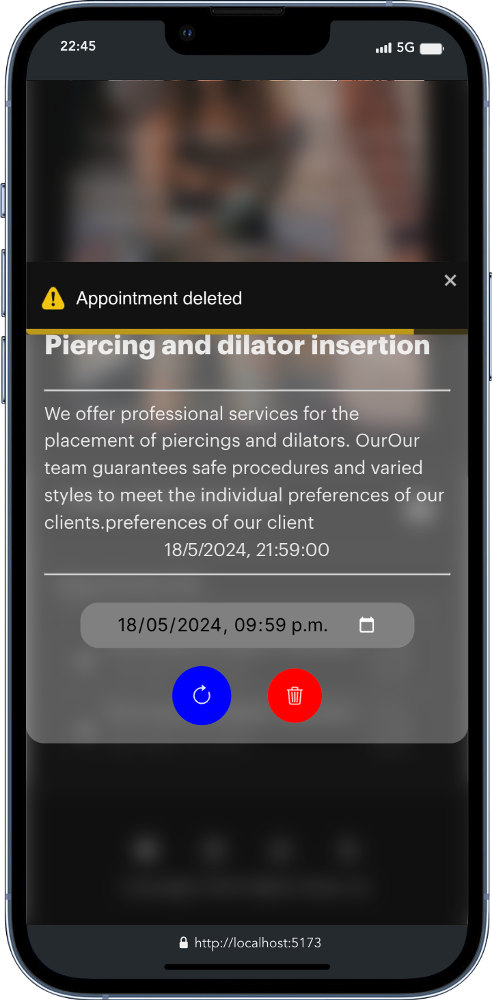
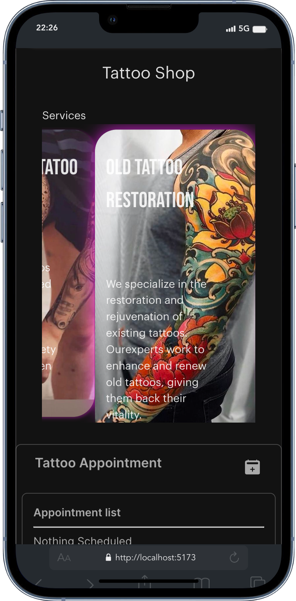
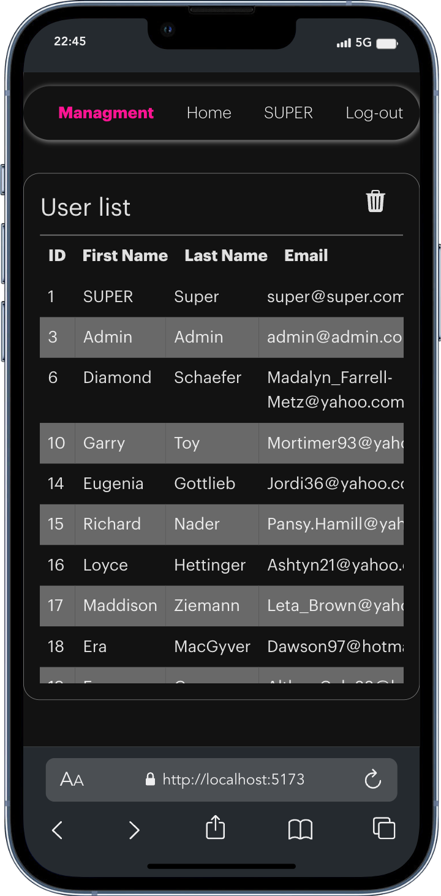
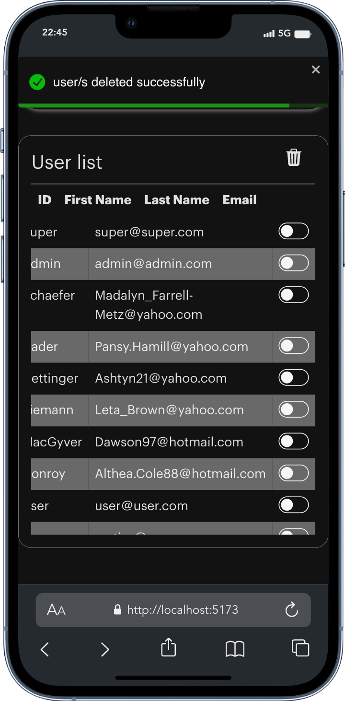

### Appointment API Frontend

---

<h4> Tattoo Shop </h4>

---

---

Very thanks for interest in my project. It's the sixth project with Geekshubs Academy of of the Full Stack Development Bootcamp 🚀. The front end design of Appointment API Backend (the fourth project of the course).

---

### Description

The users can register in the application, log in and access their personal area. area. Within their area, they will be able to view a list of scheduled appointments for tattoo and piercing services, as well as create new appointments for tattoo and piercing services, as well as create new appointments for different services offered by the services offered by the studio.

---

### Develop

Is a SPA (single-page application) with react router dom to organize the routes.
The frontend is connected to MySQL data base created in Appointment API Backend.
The data showed or the new users create are created in MySQL data base.

#### Routes

---

##### Register page

`http://localhost:5173/register`

---

#### Login page

`http://localhost:5173/login`

---

#### Home page

`http://localhost:5173`

---

#### Editable User profile

`http://localhost:5173/profile`

---

#### User Appointment List

`http://localhost:5173/home`

---

#### New Appointment users

`http://localhost:5173/home`

---

#### Delete Appointment users

`http://localhost:5173/home`

---

#### Services

`http://localhost:5173/home`

---

#### Super Admin credentials can recover users and delete it.

`http://localhost:5173/managment`

---

### Next steps

Continue build components, buttons and inputs to from respective end points created in the backend
Add Redux to use a global state to binding data of components.
Add frontend testing.

---
